# Ingestion Pipeline

Scope: PDF lecture slides in, [`output/{pdf_stem}.pdf_origin/auto/*_v1_chunks.json`](../output)
out. MCQ generation from those chunks is [04-mcq-generation.md](04-mcq-generation.md), a
separate stage.

## Pipeline diagram

```mermaid
flowchart LR
    PDF[PDF] --> MinerU["MinerU\n(separate .venv-mineru)"]
    MinerU --> Middle[("_middle.json")]
    Middle --> Parse["1. parse_json"]
    Parse --> Flatten["2. flatten_layout"]
    Flatten --> Features["3. extract_features"]
    Features --> HF["4. remove_headers_footers"]
    HF --> Classify["5. classify_blocks"]
    Classify --> Order["6. reconstruct_reading_order"]
    Order --> Tree["7. build_semantic_tree"]
    Tree --> Render["8. render_json"]
    Render --> PP[("_post_processed.json")]

    Middle --> Visuals["extract_visuals\n(middle_visuals.py)"]
    Visuals --> Caption["QwenVLCaptioner"]

    PP --> Unify["build_unified_items_from_postprocessed"]
    Caption --> Unify
    Unify --> Chunker["SemanticChunker"]
    Chunker --> Chunks[("_v1_chunks.json")]
```



Stages 1-8 are `src/post_process/pipeline.py::process_mineru_json` — a single deterministic,
rule-based function call, no ML involved. Captioning is the one ML step in this half.

## Stage-by-stage

| Stage | Module | Function | What it does |
| --- | --- | --- | --- |
| MinerU extraction | external tool | — | Runs in its own isolated venv (`.venv-mineru`), invoked as a subprocess from `scripts/ingest_data.py` with `-b pipeline -m auto`. Produces `_middle.json` (raw layout/text/image blocks) and image crops under `images/`. Kept isolated because MinerU has dependency constraints that conflict with the main project's `.venv`. |
| 1. Parse | [`src/post_process/parser/json_parser.py`](../src/post_process/parser/json_parser.py) | `parse_json` | Loads `_middle.json`, validates `pdf_info` is present, returns raw per-page dicts. |
| 2. Flatten | [`src/post_process/layout/flatten.py`](../src/post_process/layout/flatten.py) | `flatten_layout` | Converts MinerU's nested block tree into a flat `list[Block]`. Image blocks are dropped here by design — see "Visual extraction" below for why. |
| 3. Feature extraction | [`src/post_process/layout/features.py`](../src/post_process/layout/features.py) | `extract_features` | Computes per-block geometric/typographic features (font size, indentation, position ratios, bullet detection) plus page-level aggregates. |
| 4. Header/footer removal | [`src/post_process/layout/header_footer.py`](../src/post_process/layout/header_footer.py) | `remove_headers_footers` | Detects running headers/footers by finding text repeated at page-extreme positions across at least `min_repeats` pages (adaptive: 2 if ≤3 pages, else 5 — see [Conventions #5](02-conventions.md)), while protecting genuine titles from false-positive removal. |
| 5. Block classification | [`src/post_process/classification/classifier.py`](../src/post_process/classification/classifier.py) | `classify_blocks` | A hand-written scoring-rules engine (not a trained model, despite the name) assigning each block a type (`DOCUMENT_TITLE`, `SECTION_TITLE`, `PARAGRAPH`, `TABLE`, `CAPTION`, etc.) with a confidence score; blocks below `confidence_threshold` (default 0.7) become `UNKNOWN`. |
| 6. Reading order | [`src/post_process/layout/reading_order.py`](../src/post_process/layout/reading_order.py) | `reconstruct_reading_order` | Preserves MinerU's native block order, merges contiguous continuation paragraphs. |
| 7. Semantic tree | [`src/post_process/tree/builder.py`](../src/post_process/tree/builder.py) | `build_semantic_tree` | Builds the `DOCUMENT → SECTION → SLIDE → SUBHEADING → [PARAGRAPH, LIST, TABLE, CAPTION]` hierarchy. List reconstruction (nested/numbered lists across columns) is handled by `src/post_process/tree/list_builder.py::ListStackHandler`. |
| 8. Rendering | [`src/post_process/renderer/json_render.py`](../src/post_process/renderer/json_render.py) | `render_json` | Produces the structured `_post_processed.json` (`{document_title, total_pages, pages: [...]}`). A separate `renderer/markdown_render.py::render_markdown` exists for flat-Markdown output. |

All 8 stages are called in sequence by
[`src/post_process/pipeline.py::process_mineru_json(json_path, confidence_threshold=0.7)`](../src/post_process/pipeline.py) —
read that file directly if you need the exact call order, it's an 8-line function.

## Visual extraction

`flatten_layout` (stage 2) drops image blocks by design — the post-process pipeline is
text/structure only. Figures and charts are extracted separately, straight from
`_middle.json`, by
[`src/ingestion/middle_visuals.py::extract_visuals`](../src/ingestion/middle_visuals.py),
grouped by page. This is why visual extraction and text post-processing are two
independent paths that only rejoin later, in `unify.py`.

## Captioning

[`src/captioning/qwen_vl.py::QwenVLCaptioner`](../src/captioning/qwen_vl.py) (Qwen2.5-VL-7B-Instruct)
is the only captioner in current use — captions extracted visuals via `.caption()`, and
can also transcribe a full page image via `.transcribe_page()` (used by the superseded
dual-pipeline, see below). Follows the load/unload lifecycle and MPS workarounds
described in [Conventions #3-4](02-conventions.md). An earlier setup routed between this
model and a medical-specialized LLaVA-Med model; that was removed (git commit `3a6b3ce`)
in favor of Qwen2.5-VL alone.

## Unify + chunk

[`src/ingestion/unify.py::build_unified_items_from_postprocessed`](../src/ingestion/unify.py)
joins the post-processed text tree with visual captions into one ordered list of
`UnifiedItem`s (each carrying a stable `item_id` — see [Conventions #2](02-conventions.md)),
renderable as plain text or Markdown. `unify.py` also has two other builder variants
(`build_unified_items`, `build_unified_items_from_merged`) for the raw-MinerU and
dual-pipeline input shapes respectively — `_from_postprocessed` is the one the production
path (`scripts/ingest_data.py`) actually calls.

[`src/ingestion/semantic_chunk.py::SemanticChunker`](../src/ingestion/semantic_chunk.py)
embeds each `UnifiedItem` (sentence-transformers, `all-MiniLM-L6-v2`) and splits wherever
consecutive-item cosine distance exceeds an adaptive percentile threshold (see
[Conventions #5](02-conventions.md)), with a `max_chars=6000` hard fallback. Output is the
final `_v1_chunks.json` (`{doc_id, source, chunks, figures}`) — the hand-off point into
MCQ generation.

## Entry point

```bash
.venv/bin/python scripts/ingest_data.py --pdf path/to/file.pdf
.venv/bin/python scripts/ingest_data.py --dir path/to/pdf_dir   # non-recursive
```

Run with the project's **main** `.venv` (not `.venv-mineru` — that one is MinerU's own
isolated environment, invoked by this script as a subprocess). Per-PDF failures are
caught and logged without aborting a multi-PDF batch (see
[Conventions #7](02-conventions.md)). Output lands at
`output/{pdf_stem}.pdf_origin/auto/*_v1_chunks.json`.

## Superseded: the dual-pipeline approach

[`notebooks/dual_pipeline_parsing.ipynb`](../notebooks/dual_pipeline_parsing.ipynb) is an
earlier, abandoned architecture: MinerU used for visual extraction only (its own
text/OCR was judged low-quality on this document set), while a separate thread renders
each page to a PNG (`src/ingestion/page_render.py::render_pages`) and gets full-page text
via `QwenVLCaptioner.transcribe_page`. The two threads are joined purely by page index in
[`src/ingestion/merge_by_page.py`](../src/ingestion/merge_by_page.py), since they share no
common item ID. **Do not extend this path** — it was tried and replaced by the current
v1 pipeline (post_process + targeted visual captioning), which is why it's documented
here as history, not as an alternative you can pick between.

## Other notebooks

- [`v1_pipeline.ipynb`](../notebooks/v1_pipeline.ipynb) — the interactive, cell-by-cell
  equivalent of `scripts/ingest_data.py`, useful for debugging one PDF at a time.
- [`image_understanding.ipynb`](../notebooks/image_understanding.ipynb) — Stage-1 caption
  generation for the dual-pipeline track specifically; not part of the live v1 path.
- [`semantic_chunking.ipynb`](../notebooks/semantic_chunking.ipynb) — chunks the
  dual-pipeline's unified document; also not part of the live v1 path.

None of these three are additional pipelines to maintain going forward — they're
exploratory/debugging tools or artifacts of the superseded dual-pipeline architecture.

## Diagnostic tooling

[`src/evaluation/mineru_quality.py`](../src/evaluation/mineru_quality.py) is a
reference-free quality scorer for MinerU's raw output — no ground truth needed, derives
metrics from MinerU's own per-block confidence plus text heuristics (garbage-char ratio,
repeated-character runs, empty-block ratio). Run standalone:

```bash
python -m src.evaluation.mineru_quality output/**/auto/*_middle.json
python -m src.evaluation.mineru_quality output/ --recursive
```

This is a manual spot-check tool for engineers — nothing else in the repo imports it, and
it is not part of the production data path.
