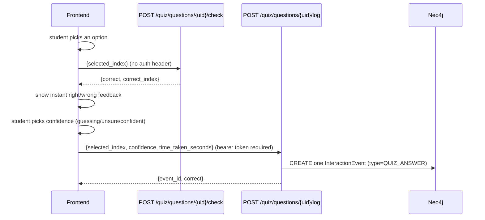

# Serving API

FastAPI app that serves quiz content and records student answers. Depends on
`question_bank.json` (content, see [04-mcq-generation.md](04-mcq-generation.md)) and
Neo4j (state, see [06-student-graph.md](06-student-graph.md)) — no ML dependencies.

## App wiring

[`app/main.py`](../app/main.py) wires two routers: `students` and `quiz`, plus a bare
`GET /health`. Run locally with `.venv/bin/uvicorn app.main:app --reload` (needs
`make neo4j-up` first — see [07-operations.md](07-operations.md)).

## Auth model

Bearer session tokens, opaque and server-revocable — see
[06-student-graph.md](06-student-graph.md)'s session security model for why (never JWT).
[`app/dependencies.py::get_current_student_id`](../app/dependencies.py) is the shared
FastAPI dependency: validates the bearer token via
`src/student_kg/session.py::validate_session`, raises `401` if invalid/expired/revoked,
otherwise returns the student id. Any endpoint that needs to know *which* student is
calling depends on this; endpoints that don't (like `/check`, see below) don't.

## Students router

[`app/routers/students.py`](../app/routers/students.py):

| Endpoint | Auth | Does |
| --- | --- | --- |
| `POST /students/register` | none | Creates a `Student` + genesis event, issues a session. |
| `POST /students/login` | none | Looks up student by `student_number`, issues a new session. |
| `POST /students/logout` | bearer | Revokes the calling session. |

## Quiz router — topics and questions

[`app/routers/quiz.py`](../app/routers/quiz.py):

| Endpoint | Auth | Does |
| --- | --- | --- |
| `GET /quiz/topics` | none | Lists all topic paths (from `src/quiz/bank.py`'s flattened bank). |
| `GET /quiz/topics/{topic_path}/questions` | none | Returns sanitized questions for a topic — `correct` flags stripped, see `OptionOut`/`QuestionOut` in [`app/schemas.py`](../app/schemas.py). |

The answer key never leaves `src/quiz/bank.py` — `QuestionOut`'s options only carry
`index` + `text`, position doubling as the client-facing answer id.

## Quiz router — check / log

This is the part of the API with real design history behind it, worth reading in full.

**`POST /quiz/questions/{uid}/check`** — pure grading. No auth, no graph write.
`{selected_index}` → `{correct, correct_index}`. Exists purely so the frontend can show
instant feedback the moment a student picks an option, before confidence is known.

**`POST /quiz/questions/{uid}/log`** — the one write for the whole attempt. Requires a
bearer token. `{selected_index, confidence, time_taken_seconds}` →
`{event_id, correct}`. Calls `src/quiz/attempts.py::record_attempt`, which creates
exactly one `InteractionEvent` carrying `selected_index`, `correct`, `confidence`, and
`time_taken_seconds` together.

### Known design history — do not re-merge these endpoints

The original design was a single combined endpoint that required `confidence` up front,
in the same request as `selected_index`. That didn't match the actual frontend flow: the
UI grades the answer **instantly** on option-pick (for immediate feedback), and only asks
for a confidence level *afterward*. Forcing both into one call meant the frontend had to
either delay feedback until confidence was picked, or fire two separate requests per
question.

It fired two requests. That produced **two separate `InteractionEvent` nodes per
question** instead of one — confirmed directly by inspecting Neo4j Browser mid-session:
a chain of alternating `TRUE`/`FALSE`-captioned nodes and `"guessing"`-captioned nodes,
linked by `:NEXT`, instead of one node per question carrying both `correct` and
`confidence`. An intermediate fix (grade-and-write immediately with `confidence: null`,
then a second call to `SET` confidence onto the same node) was considered and rejected in
favor of the current design, because it left a **partial** event briefly in the graph
between the two calls — acceptable for some systems, not desirable here given the
event-sourcing model treats every event as a complete, immutable fact once written (see
[06-student-graph.md](06-student-graph.md)).

The current split — `/check` truly stateless, `/log` a single atomic write fired only
once every field is known — is the fix. **If you're tempted to merge `/check` and `/log`
back into one endpoint to "simplify" the API, don't**, unless the frontend flow itself
changes to ask for confidence before grading (unlikely, since instant feedback is the
point of `/check` existing at all).

## `src/quiz/bank.py` internals

[`src/quiz/bank.py::load_question_bank`](../src/quiz/bank.py) reads
`question_bank.json` once at first call and caches it (`@lru_cache(maxsize=1)`) — the
bank never changes while the server is running, so there's no reason to re-parse per
request. `_is_usable()` filters out any question where
`critique.valid_as_generated == false` (see [04-mcq-generation.md](04-mcq-generation.md)
for what that field actually means and its current ~62% exclusion rate). The file path
is overridable via the `QUESTION_BANK_PATH` env var, defaulting to
`notebooks/mcq_output/question_bank.json`.
