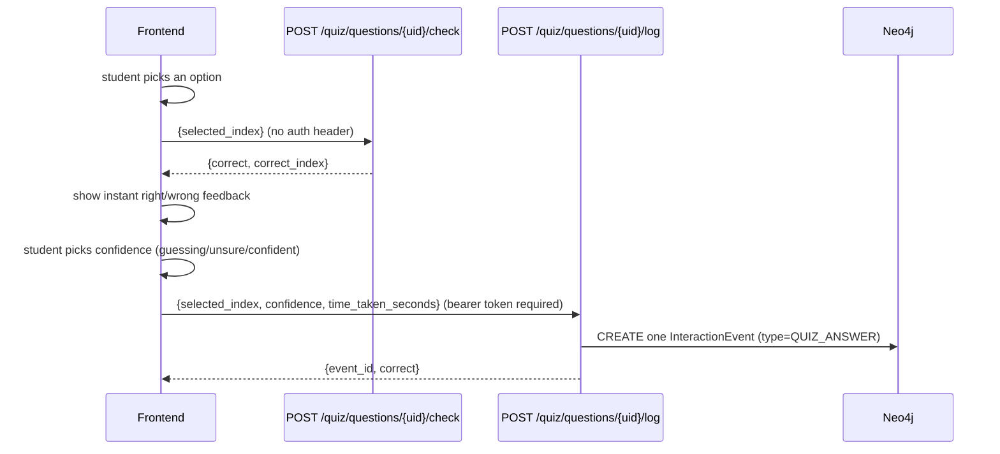

# Serving API

FastAPI app that serves quiz content and records student answers. Depends on postgres
(content, the `mcq_questions` table — see [04-mcq-generation.md](04-mcq-generation.md))
and Neo4j (state, see [06-student-graph.md](06-student-graph.md)).

## App wiring

[`app/main.py`](../app/main.py) wires three routers — `students`, `quiz`, `flashcards`
— plus a bare `GET /health`. Also installs, in order: `slowapi` rate limiting
(`app.state.limiter`, 429s routed through the shared error envelope), CORS
(`CORSMiddleware`, origins from the `CORS_ALLOWED_ORIGINS` env var — comma-separated,
**not currently in `.env.example`**, defaults to no allowed origins if unset),
`SessionAuthMiddleware` (below), and `register_exception_handlers` (below). Run locally
with `.venv/bin/uvicorn app.main:app --reload` (needs `make neo4j-up` first — see
[07-operations.md](07-operations.md)).

## Auth model

Bearer session tokens, opaque and server-revocable — see
[06-student-graph.md](06-student-graph.md)'s session security model for why (never JWT).

Two layers now do auth-related work:

- [`app/auth_middleware.py::SessionAuthMiddleware`](../app/auth_middleware.py) —
  app-wide `BaseHTTPMiddleware` that runs before routing. Requests to an **allowlisted**
  path skip auth entirely; everything else must carry a valid `Authorization: Bearer
  <token>` header or the middleware short-circuits with a `401` (via `app/errors.py`'s
  envelope) before the request reaches the route handler. The allowlist is exact paths
  (`/health`, `/students/register`, `/students/login`, `/docs`, `/openapi.json`, `/redoc`,
  `/docs/oauth2-redirect`) plus **regexes**, not prefixes — e.g. `^/quiz/topics/.+/questions$`
  is open but `^/quiz/questions/[^/]+/log$` is not, because a naive prefix match would
  wrongly open sibling write endpoints under the same parent path. See the module's own
  comments before adding a new public route — get the regex specific enough that it
  can't accidentally open a write endpoint.
- [`app/dependencies.py::get_current_student_id`](../app/dependencies.py) — the
  per-route FastAPI dependency that reads `request.state.student_id` (set by the
  middleware above) for handlers that need to know *which* student is calling.

Practically: if a route needs to be public, it must be added to
`auth_middleware.py`'s allowlist *and* must not declare `get_current_student_id` as a
dependency. Public routes as of this doc: `GET /quiz/topics`, `GET /quiz/subjects`,
`GET /quiz/topics/{path}/questions`, `POST /quiz/questions/{uid}/check`,
`GET /flashcards/cards`, `GET /flashcards/topics/{path}/cards`,
`POST /flashcards/cards/{uid}/reveal` — all pure catalog lookups or stateless grading,
no graph write.

## Error envelope

[`app/errors.py`](../app/errors.py) — every error response, regardless of source
(`HTTPException`, Pydantic validation, Neo4j driver errors, or an unhandled exception),
comes back as:

```json
{"error": {"code": "NOT_FOUND", "message": "...", "details": [...]}}
```

`code` is the stable, machine-readable field clients should branch on; `message` is
human-readable and may change wording. Neo4j `ConstraintError` maps to `409`,
`ServiceUnavailable` to `503`, any other `Neo4jError` or unhandled exception to a generic
`500` — **nothing internal (Cypher text, stack traces, driver messages) ever reaches the
client**; full detail is logged server-side only (`logging.getLogger("api.errors")`).
Route decorators document possible error responses per-endpoint via
`app/openapi.py::error_responses(...)`, e.g. `responses=error_responses(401, 404)`.

## Students router

[`app/routers/students.py`](../app/routers/students.py):

| Endpoint | Auth | Does |
| --- | --- | --- |
| `POST /students/register` | none (rate-limited 5/min) | Creates a `Student` + genesis event, issues a session. |
| `POST /students/login` | none (rate-limited 10/min) | Looks up student by `student_number`, issues a new session. |
| `POST /students/logout` | bearer | Revokes the calling session. |
| `GET /students/me` | bearer | Session check — `{authenticated, student_id}`. |
| `GET /students/me/profile` | bearer | Full student profile (name, student number, academic year, enrolled_at). |
| `GET /students/me/streak` | bearer | Consecutive-UTC-day activity streak + this week's activity — see `src/student_kg/streak.py`. |
| `POST /students/me/streak/restore` | bearer | Spends energy (`RESTORE_STREAK_COST = 10`) to bridge exactly one missed day and revive a just-broken streak. `409` if not eligible (gap isn't exactly one day, or insufficient energy). |
| `GET /students/me/energy` | bearer | Current energy balance (gamification currency — see `src/student_kg/energy.py`). |
| `GET /students/me/nudge` | bearer | Dashboard "come back and study" signal: quiz + flashcard due counts, plus whichever single item is due soonest across both. |

**Streak semantics**: `previous_streak` equals `current_streak` while a streak is
active, but holds the length of the run that just ended once `current_streak` reads `0`
(broken) — frontend should show "streak broken" using `previous_streak` when
`current_streak == 0 and previous_streak > 0`. Full logic in `src/student_kg/streak.py`.

**Energy**: awarded on finishing a quiz session (`POST /quiz/sessions/{id}/end`) or
logging a flashcard review (`POST /flashcards/cards/{uid}/log`) — those endpoints return
the award inline; `GET /students/me/energy` exists purely to re-sync a displayed balance
(e.g. after another tab/device earned energy) without waiting on the next award event.

## Quiz router — topics, subjects, and questions

[`app/routers/quiz.py`](../app/routers/quiz.py):

| Endpoint | Auth | Does |
| --- | --- | --- |
| `GET /quiz/topics` | none | Lists all topic paths (from `src/quiz/bank.py`'s flattened bank). |
| `GET /quiz/subjects` | none | Subject → topic catalog for a browse page; `question_count`/`flashcard_count` per subject and per topic. |
| `GET /quiz/topics/{topic_path}/questions` | none | Returns sanitized questions for a topic — `correct` flags stripped, see `OptionOut`/`QuestionOut` in [`app/schemas.py`](../app/schemas.py). |

The answer key never leaves `src/quiz/bank.py` — `QuestionOut`'s options only carry
`index` + `text`, position doubling as the client-facing answer id.

**Note**: `SubjectOut.flashcard_count` mirrors `question_count` — every flashcard is a
1:1 derivation of a bank question (`src/flashcards/cards.py`), there's no separately
authored flashcard content to count differently.

## Quiz router — sessions and history

Quiz-taking is now session-scoped, not just individual question check/log calls:

| Endpoint | Auth | Does |
| --- | --- | --- |
| `POST /quiz/topics/{topic_path}/sessions` | bearer | Starts a quiz run for a topic; returns `session_id` to pass to every subsequent `/log` call in this run. |
| `POST /quiz/sessions/{id}/end` | bearer | Call after the last question — aggregates every answer linked to the session into `question_count`/`correct_count`/`duration_seconds`. |
| `POST /quiz/sessions/{id}/cancel` | bearer | Call instead of `/end` if the student abandons the run partway (navigate away, close app) — same aggregation, marked `cancelled` instead of `completed` in `/history`. Already-logged answers and their mastery updates are **not** undone. |
| `GET /quiz/history` | bearer | Completed/cancelled quiz sessions for the student, most recent first. Day-bucketing (Today/Yesterday/This Week) is left to the frontend. |
| `GET /quiz/review/due` | bearer | Questions the student has answered before whose spaced-repetition schedule says they're due again, soonest-due first. A never-answered question has no schedule and never appears here. |

Session/history/due-review logic lives in `src/quiz/sessions.py` and
`src/quiz/attempts.py::due_for_review`.

## Quiz router — mastery

| Endpoint | Auth | Does |
| --- | --- | --- |
| `GET /quiz/mastery` | bearer | This student's current per-topic mastery (`p_know`), weakest topic first. |
| `PUT /quiz/mastery` | bearer | Persists client-computed `p_know` per topic, overwriting whatever was previously stored. |

**Important — where the mastery number comes from.** `p_know` is computed **on-device by
the frontend's own Bayesian Knowledge Tracing (BKT) implementation**, then pushed here.
`src/quiz/mastery.py` does **no BKT math server-side** and applies **no bounds/validation**
to the incoming `p_know` — it trusts the client's algorithm entirely and just persists the
value (`:MASTERS` edge, `updated_at` stamped on write). A topic never pushed by the
client has no `:MASTERS` edge and doesn't appear in `GET /quiz/mastery`.

This is worth being explicit about relative to [06-student-graph.md](06-student-graph.md)'s
original design note ("No `Mastery` node exists yet, deliberately... mastery is meant to
be a measurement derived from event history, never an assumption asserted at any single
point in time"). This endpoint **stores** a mastery value, but it's the client's derived
measurement being persisted for sync/display purposes, not the server asserting a mastery
level as ground truth independent of the underlying event history — the server still does
zero mastery inference of its own. Whether that distinction fully satisfies the original
design intent, or represents drift from it, is worth a direct conversation with whoever
owns the BKT client implementation — flagged here rather than silently resolved either way.

## Quiz router — check / log

This is the part of the API with real design history behind it, worth reading in full.



**`POST /quiz/questions/{uid}/check`** — pure grading. No auth, no graph write.
`{selected_index}` → `{correct, correct_index, explanation}`. Exists purely so the
frontend can show instant feedback (and now the explanation) the moment a student picks
an option, before confidence is known.

**`POST /quiz/questions/{uid}/log`** — the one write for the whole attempt. Requires a
bearer token. `{session_id, selected_index, confidence, time_taken_seconds,
next_review_days?}` → `{event_id, correct, next_review_at}`. Calls
`src/quiz/attempts.py::record_attempt`, which creates exactly one `InteractionEvent`
carrying `selected_index`, `correct`, `confidence`, and `time_taken_seconds` together,
and also updates the question's spaced-repetition schedule (`next_review_at`, surfaced
via `GET /quiz/review/due`). `session_id` (from `POST /quiz/topics/{path}/sessions`,
see below) links the attempt to a quiz run; `next_review_days`, if given, is the
student's own explicit choice of when to see the question again and overrides the
streak-computed schedule for this question.

### Known design history — do not re-merge these endpoints

The original design was a single combined endpoint that required `confidence` up front,
in the same request as `selected_index`. That didn't match the actual frontend flow: the
UI grades the answer **instantly** on option-pick (for immediate feedback), and only asks
for a confidence level *afterward*. Forcing both into one call meant the frontend had to
either delay feedback until confidence was picked, or fire two separate requests per
question.

It fired two requests. That produced **two separate `InteractionEvent` nodes per
question** instead of one — confirmed directly by inspecting Neo4j Browser mid-session:
a chain of alternating `TRUE`/`FALSE`-captioned nodes and `"guessing"`-captioned nodes,
linked by `:NEXT`, instead of one node per question carrying both `correct` and
`confidence`. An intermediate fix (grade-and-write immediately with `confidence: null`,
then a second call to `SET` confidence onto the same node) was considered and rejected in
favor of the current design, because it left a **partial** event briefly in the graph
between the two calls — acceptable for some systems, not desirable here given the
event-sourcing model treats every event as a complete, immutable fact once written (see
[06-student-graph.md](06-student-graph.md)).

The current split — `/check` truly stateless, `/log` a single atomic write fired only
once every field is known — is the fix. **If you're tempted to merge `/check` and `/log`
back into one endpoint to "simplify" the API, don't**, unless the frontend flow itself
changes to ask for confidence before grading (unlikely, since instant feedback is the
point of `/check` existing at all).

## Flashcards router

[`app/routers/flashcards.py`](../app/routers/flashcards.py) — an Anki-style spaced-
repetition feature, structurally parallel to the quiz router but with its own scheduling
model (per-card streak/interval rather than quiz's session-based mastery). Every
flashcard is derived 1:1 from a bank question (`src/flashcards/cards.py`) — there's no
separately authored flashcard content.

| Endpoint | Auth | Does |
| --- | --- | --- |
| `GET /flashcards/cards` | none | Lists every flashcard (front + metadata only). |
| `GET /flashcards/topics/{topic_path}/cards` | none | Cards for one topic. |
| `POST /flashcards/sessions` | bearer | Starts an Anki-style batch (default `DEFAULT_SESSION_SIZE = 10` cards) drawn from the whole deck: due-for-review cards first (soonest-due), then never-reviewed cards top up the rest. |
| `POST /flashcards/topics/{topic_path}/sessions` | bearer | Same, scoped to one topic. |
| `POST /flashcards/sessions/{id}/end` | bearer | Aggregates how many of the batch's cards got a rating logged during the session window. |
| `POST /flashcards/sessions/{id}/cancel` | bearer | Same aggregation as `/end`, marks the session `cancelled` instead of `completed`. |
| `GET /flashcards/sessions/history` | bearer | Completed/cancelled flashcard sessions, most recent first. |
| `POST /flashcards/cards/{uid}/reveal` | none | Pure lookup — no auth, no graph write. Returns `back` + `explanation`. Called when the student flips the card, after self-assessing recall in their head. |
| `POST /flashcards/cards/{uid}/log` | bearer | Records an Again/Hard/Good/Easy `rating` once the card is flipped. Updates the card's own spaced-repetition schedule (independent of quiz mastery), links the review to `session_id` via `:HAS_ANSWER`. Returns `{event_id, streak, interval_days, next_review_at, energy_awarded, energy_balance}`. |
| `GET /flashcards/cards/{uid}/history` | bearer | Every rating this student has given this specific card, oldest first — the raw trail behind the card's current streak/interval. |
| `GET /flashcards/history` | bearer | Every flashcard review this student has ever logged, most recent first — a flat feed (one row per rating), not session-grouped. Rows whose question no longer exists in the bank are skipped, since the bank can be regenerated independently of logged history. |
| `GET /flashcards/review/due` | bearer | Cards due for review now, soonest-due first. A never-reviewed card has no schedule and never appears here. |

Reveal/log logic: `src/flashcards/cards.py`, `src/flashcards/reviews.py`. Session
logic: `src/flashcards/sessions.py`. Same event-sourced pattern as the quiz side
(append-only, session-linked), but a genuinely separate scheduling model — don't assume
quiz mastery and flashcard streak/interval share any state.

## `src/quiz/bank.py` internals

[`src/quiz/bank.py::load_question_bank`](../src/quiz/bank.py) queries the `mcq_questions`
postgres table once at first call and caches the result (`@lru_cache(maxsize=1)`) — the
bank never changes while the server is running, so there's no reason to re-query per
request. The table is populated offline by
[`scripts/populate_mcq_postgres.py`](../scripts/populate_mcq_postgres.py) from
`notebooks/master_mcq_with_topics.json`; connection params come from the same
`POSTGRES_USER`/`POSTGRES_PASSWORD`/`POSTGRES_DB`/`POSTGRES_HOST`/`POSTGRES_PORT` env vars
mlflow's backend store uses (see [07-operations.md](07-operations.md)). This same cached
bank backs both `src/quiz/` and `src/flashcards/cards.py` — flashcards have no separate
content table.
