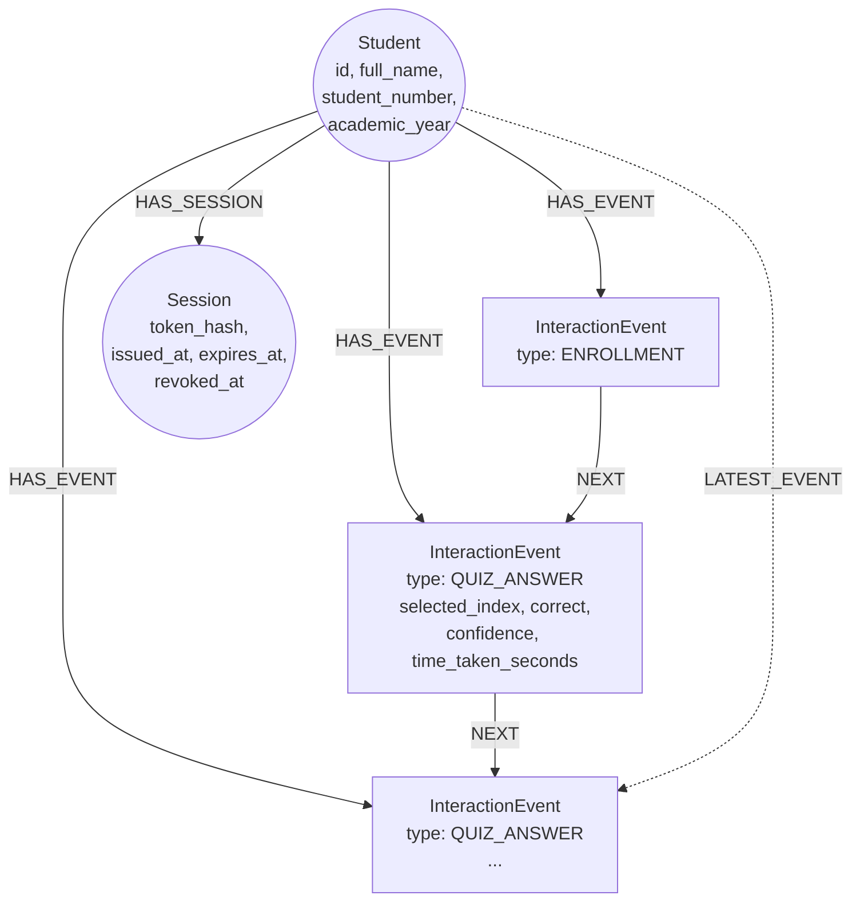

# Student Graph

Neo4j schema backing the serving layer: students, sessions, and quiz attempts, modeled as
an append-only event chain.

## Schema diagram

`HAS_EVENT` fans out from `Student` to every event (a set); `NEXT` chains events in
chronological order (a linked list); `LATEST_EVENT` is a single pointer that gets
repointed to the newest event on every write, so appends never need to walk the chain to
find where to attach. This is why it's drawn as a separate dashed edge — it's not a
third relationship type in the same family as `HAS_EVENT`/`NEXT`, it's a cursor.

## Node types

**`Student`** — `id` (uuid), `full_name`, `student_number` (unique), `academic_year`
(1-6), `enrolled_at`. Created by
[`src/student_kg/enrollment.py::enroll_student`](../src/student_kg/enrollment.py).

**`InteractionEvent`** — polymorphic via `type`:
- `ENROLLMENT` (genesis event): `id`, `type`, `ts`. Created alongside the `Student` node
  itself — every student has exactly one, and it has no predecessor (it *is* the
  predecessor for the first `NEXT` link).
- `QUIZ_ANSWER`: `id`, `type`, `question_uid`, `selected_index`, `correct`, `confidence`
  (`"guessing"` / `"unsure"` / `"confident"`), `time_taken_seconds`, `ts`. Created by
  [`src/quiz/attempts.py::record_attempt`](../src/quiz/attempts.py).

No `Mastery` node exists yet, deliberately — mastery is meant to be a measurement derived
from the `QUIZ_ANSWER` event history (correctness × confidence × time), never an
assumption asserted at any single point in time. See
[`src/student_kg/enrollment.py`](../src/student_kg/enrollment.py)'s module docstring for
the original statement of this design intent.

**`Session`** — `token_hash` (unique, SHA-256 of the raw token), `student_id`,
`issued_at`, `expires_at`, `revoked_at` (nullable). Created by
[`src/student_kg/session.py::create_session`](../src/student_kg/session.py).

## Relationship types

- **`HAS_EVENT`** (`Student → InteractionEvent`) — every event a student has ever
  triggered, unordered on its own.
- **`NEXT`** (`InteractionEvent → InteractionEvent`) — chronological chain across *all*
  event types, not just quiz answers. This is why event-driver code (enrollment,
  attempts) is written generically against "the latest event," rather than "the latest
  quiz answer" — a future event type (e.g. a flashcard review) slots into the same chain
  without new relationship types.
- **`LATEST_EVENT`** (`Student → InteractionEvent`) — repointed on every write (old one
  deleted, new one created) rather than computed by walking `NEXT` from the start. Keeps
  appends O(1) regardless of how long a student's history gets.
- **`HAS_SESSION`** (`Student → Session`) — every session ever issued, live or expired or
  revoked; validity is determined by reading `expires_at`/`revoked_at` on the node, not
  by which relationships exist.

## Uniqueness constraints

Set up by [`src/student_kg/driver.py::ensure_constraints`](../src/student_kg/driver.py),
run automatically on driver creation (see `app/dependencies.py`):

| Constraint | Protects against |
| --- | --- |
| `student_id_unique` (`Student.id`) | Duplicate student records from a UUID collision or a bug creating two nodes for one enrollment. |
| `student_number_unique` (`Student.student_number`) | Two students registering with the same institutional student number. |
| `event_id_unique` (`InteractionEvent.id`) | Duplicate events from a retried write. |
| `session_token_hash_unique` (`Session.token_hash`) | Two sessions colliding on the same hashed token (would only happen from a `secrets.token_urlsafe` collision, astronomically unlikely, but enforced anyway). |

## Session security model

Tokens are **opaque and random** (`secrets.token_urlsafe(32)`), never a stateless JWT —
[`src/student_kg/session.py`](../src/student_kg/session.py)'s module docstring states why
directly: the backend needs to actually revoke and expire sessions on its own terms,
which a self-contained JWT can't do without an additional denylist anyway. Only the
SHA-256 hash of the token is ever persisted; the raw token is returned to the caller
exactly once, at issuance (register or login), so a Neo4j dump/leak can't be replayed as
a live session. Default TTL is one week (`DEFAULT_TTL_HOURS = 24 * 7`).
`revoke_session` kills one token; `revoke_all_sessions_for_student` kills every live
session for a student (e.g. for a future "log out everywhere" feature).

## Module map

- `src/student_kg/driver.py` — Neo4j driver singleton + constraint setup.
- `src/student_kg/enrollment.py` — creates the `Student` node + genesis `ENROLLMENT`
  event.
- `src/student_kg/session.py` — session issuance, validation, revocation.
- `src/quiz/attempts.py` — `record_attempt()`, writes `QUIZ_ANSWER` events onto the same
  chain.
- `src/quiz/bank.py` — question content, not graph-related at all (see
  [05-serving-api.md](05-serving-api.md)).

**Why attempt-recording lives in `src/quiz/`, not `src/student_kg/`:** it's graph-adjacent
(it writes `InteractionEvent` nodes using the exact same chain pattern as enrollment) but
it's also content-aware — it needs to know about `question_uid`, `selected_index`, and
grading, none of which `student_kg` otherwise knows anything about. Keeping it in `quiz/`
means `student_kg/` stays a pure graph-primitives module (student identity, sessions,
generic event chaining) with no knowledge of quiz-specific concepts.
