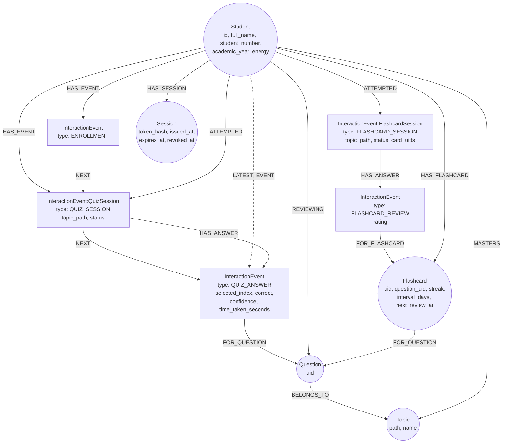

# Student Graph

Neo4j schema backing the serving layer: students, sessions, and quiz/flashcard activity.
Core answer/review history is an append-only event chain; layered on top of it are
per-question spaced-repetition edges, a topic hierarchy, and (newest, and worth reading
closely) a non-event-sourced mastery edge.

## Schema diagram

`HAS_EVENT` fans out from `Student` to every event (a set); `NEXT` chains events in
chronological order (a linked list) across **all** event types; `LATEST_EVENT` is a
single pointer repointed to the newest event on every write — drawn dashed since it's a
cursor, not a third relationship in the `HAS_EVENT`/`NEXT` family. `ATTEMPTED` +
`HAS_ANSWER` are a second, session-scoped grouping layered on the same events (a
`QUIZ_ANSWER` is reachable both via the chronological chain and via its owning
`QuizSession`). `REVIEWING`, `HAS_FLASHCARD`, and `MASTERS` sit outside the event chain
entirely — they're mutable state, not immutable facts — see their own sections below.

## Node types

**`Student`** — `id` (uuid), `full_name`, `student_number` (unique), `academic_year`
(1-6), `enrolled_at`, `energy` (int, gamification balance — see "Energy"). Created by
[`src/student_kg/enrollment.py::enroll_student`](../src/student_kg/enrollment.py).

**`InteractionEvent`** — polymorphic via `type`, chained chronologically regardless of
type:

- `ENROLLMENT` (genesis event): `id`, `type`, `ts`. Created alongside `Student` — every
  student has exactly one, with no predecessor.
- `QUIZ_SESSION` (extra label `:QuizSession`): `id`, `type`, `topic_path`, `status`
  (`in_progress`/`completed`/`cancelled`), `ts`. Created by
  [`src/quiz/sessions.py::start_session`](../src/quiz/sessions.py).
- `QUIZ_ANSWER`: `id`, `type`, `question_uid`, `selected_index`, `correct`, `confidence`
  (`"guessing"`/`"unsure"`/`"confident"`), `time_taken_seconds`, `ts`. Linked to its
  `QuizSession` via `:HAS_ANSWER` and to a `Question` node via `:FOR_QUESTION`. Created
  by [`src/quiz/attempts.py::record_attempt`](../src/quiz/attempts.py) — **not** linked
  directly to `Student` via `HAS_EVENT`/`NEXT` (it reaches the student only through its
  session), specifically to avoid extending the top-level chronological chain down to
  every single question.
- `FLASHCARD_SESSION` (extra label `:FlashcardSession`): `id`, `type`, `topic_path`
  (nullable — whole-deck sessions have none), `status`, `card_uids` (the fixed batch
  picked at start time — no live cursor, unlike `QuizSession`). Created by
  [`src/flashcards/sessions.py::start_session`](../src/flashcards/sessions.py).
- `FLASHCARD_REVIEW`: `id`, `type`, `question_uid`, `rating`
  (`again`/`hard`/`good`/`easy`), `ts`. Linked to its `FlashcardSession` via
  `:HAS_ANSWER` and to a `Flashcard` node via `:FOR_FLASHCARD`. Created by
  [`src/flashcards/reviews.py::record_review`](../src/flashcards/reviews.py).

**`Session`** (auth session) — `token_hash` (unique, SHA-256), `student_id`,
`issued_at`, `expires_at`, `revoked_at` (nullable). Unrelated to `QuizSession`/
`FlashcardSession` above despite the name overlap. Created by
[`src/student_kg/session.py::create_session`](../src/student_kg/session.py).

**`Question`** — `uid` only, `MERGE`d (deduped across every student/session that has
ever answered it) by `record_attempt()`. Content (stem, options, explanation) lives
entirely in Postgres (`src/quiz/bank.py`) — this node exists purely as a graph anchor for
`REVIEWING`, `FOR_QUESTION`, and `BELONGS_TO` edges, not as a content copy.

**`Flashcard`** — `uid` (deterministic SHA-1 hash of `student_id::question_uid`, so
repeated reviews of the same card `MERGE` onto one node), `question_uid`, `streak`,
`interval_days`, `last_reviewed_at`, `next_review_at`. One `Flashcard` node per
student+question pair — this is where flashcard-side spaced-repetition state lives (see
"Flashcard scheduling" below); card front/back/explanation text still comes from the
bank via `question_uid`, not stored here.

**`Topic`** — `path`, `name`. Built two ways: `record_attempt()` `MERGE`s a chain of
nested `Topic` nodes from each answer's `topic_tag` (e.g. `["ENDOCRINOLOGY", "FUNCTIONS
OF HORMONE"]` becomes two `Topic` nodes linked `SUB_TOPIC_OF`), and `Question
-[:BELONGS_TO]-> Topic` (leaf only) lets progress roll up to any topic level; separately,
`src/quiz/mastery.py::upsert_mastery` also `MERGE`s a `Topic` node purely as the target
of a `:MASTERS` edge. Both code paths converge on the same node identity (`path`), so a
topic reached through answering questions and a topic reached through pushed mastery are
the same node once both have happened.

## Per-question spaced repetition — `REVIEWING` (quiz side)

`Student -[:REVIEWING {streak, interval_days, attempt_count, last_reviewed_at,
next_review_at}]-> Question`. Updated on every `record_attempt()` call
([`src/quiz/attempts.py`](../src/quiz/attempts.py)):

- Only a **correct AND confident** answer counts as a "strong pass" — grows `streak` and
  doubles `interval_days` (1→2→4→8… days, capped at 60). A correct-but-guessed or
  correct-but-unsure answer resets the streak and schedules review tomorrow, same as a
  wrong answer — a lucky/unsure correct answer isn't treated as real evidence of
  retention.
- `attempt_count` is a separate lifetime counter that never resets (unlike `streak`) —
  high `attempt_count` with persistently low `streak` signals a question the student
  keeps missing confidently, which plain correct/incorrect history wouldn't surface.
- `next_review_days` on `POST /quiz/questions/{uid}/log` lets the student override the
  computed schedule with their own choice; the streak/attempt_count math still runs
  unchanged, only the resulting review date is overridden.

`GET /quiz/review/due` reads this edge (`due_for_review` in the same module).

## Flashcard scheduling — `Flashcard` node (flashcard side)

Deliberately **not** the same mechanism as `REVIEWING` — a card rated "Easy" and a
question answered "confident and correct" are different kinds of evidence, and neither
schedule should silently update the other's. Interval growth per rating (capped at 60
days, same ceiling as quiz):

| Rating | Streak | Interval |
| --- | --- | --- |
| `again` | resets to 0 | resets to 1 day |
| `hard` | unchanged | ×1.2 |
| `good` | +1 | ×2.0 (same curve as quiz's strong-pass) |
| `easy` | +1 | ×2.5 |

`GET /flashcards/review/due` reads `Flashcard.next_review_at` directly (`due_for_review`
in [`src/flashcards/reviews.py`](../src/flashcards/reviews.py)).

## Mastery — `MASTERS`, not event-sourced, by design trade-off

`Student -[:MASTERS {p_know, updated_at}]-> Topic`. Written by
[`src/quiz/mastery.py`](../src/quiz/mastery.py) via `PUT /quiz/mastery`
(see [05-serving-api.md](05-serving-api.md)) — worth reading closely against this doc's
earlier design position.

The original design intent recorded here (and still accurate as a description of the
*event* model, `REVIEWING`/`Flashcard` included): mastery-like state should be
**derived**, never asserted at a single point in time, so it's always recomputable and
never a stale, unaudited fact — `REVIEWING` and `Flashcard` both follow that: every field
on them is recomputed from the incoming event each time, not pushed from outside as a
final answer.

`:MASTERS` is different in kind, not just in name: `p_know` arrives **pre-computed** from
the client (the frontend's own Bayesian Knowledge Tracing implementation) and is
overwritten wholesale on every `PUT`, with no history retained. `src/quiz/mastery.py`
does zero clamping, recomputation, or validation server-side — it is, by its own module
docstring, "a thin, deliberately dumb persistence layer." The event history `p_know` is
presumably derived from (`QUIZ_ANSWER`/`FLASHCARD_REVIEW`) still exists and is still
queryable — so nothing is lost — but the graph now also holds a value nobody server-side
can recompute or audit if the client's math has a bug.

Whether "client derives it from real event history, server only persists the latest
number for sync/display" is a faithful extension of the original principle, or a
walk-back of it, is a genuinely open question flagged for whoever owns the BKT client —
not resolved either way in this doc.

A partial server-side answer to this question is now wired in, but it's narrower than
"the server computes `p_know`": [09-knowledge-tracing.md](09-knowledge-tracing.md) fits
BKT's shared *parameters* (`p_init`/`p_transit`/`p_slip`/`p_guess` — a population-level
property, not per-student) over this same event history
(`QUIZ_ANSWER` + `REVIEWING.attempt_count`), served via `GET /quiz/mastery/params`
(`src/quiz/bkt_fit.py`) and fetched/cached by the client. AUC 0.6819 next-step
prediction on 10.4k dummy attempts after EM-fitting, vs. 0.5658 for the original
hand-picked params — see [09-knowledge-tracing.md](09-knowledge-tracing.md) for the
formula. `p_know` itself is still entirely client-computed and pushed via `PUT
/quiz/mastery` exactly as described above — the open question in this section is
unresolved by that endpoint.

## Relationship types

| Relationship | Direction | Notes |
| --- | --- | --- |
| `HAS_EVENT` | `Student → InteractionEvent` | Every event a student ever triggered (unordered set). |
| `NEXT` | `InteractionEvent → InteractionEvent` | Chronological chain across all event types. |
| `LATEST_EVENT` | `Student → InteractionEvent` | Cursor, repointed on every write — O(1) appends. |
| `HAS_SESSION` | `Student → Session` | Every auth session ever issued; validity read from `expires_at`/`revoked_at`. |
| `ATTEMPTED` | `Student → QuizSession \| FlashcardSession` | Every quiz/flashcard session started, any status. |
| `HAS_ANSWER` | `QuizSession → QUIZ_ANSWER`, `FlashcardSession → FLASHCARD_REVIEW` | Groups events into their owning session; same edge name reused for both. |
| `FOR_QUESTION` | `QUIZ_ANSWER → Question`, `Flashcard → Question` | Links an event/schedule back to the question it's about. |
| `FOR_FLASHCARD` | `FLASHCARD_REVIEW → Flashcard` | Links a review event to its card's schedule state. |
| `REVIEWING` | `Student → Question` | Quiz-side spaced-repetition state — see above. |
| `HAS_FLASHCARD` | `Student → Flashcard` | Owns a card's schedule state — see above. |
| `SUB_TOPIC_OF` | `Topic → Topic` | Nested topic hierarchy built from `topic_tag` on each answer. |
| `BELONGS_TO` | `Question → Topic` | Leaf-topic membership for a question. |
| `MASTERS` | `Student → Topic` | Client-pushed `p_know` — see "Mastery" above. |

## Energy

`Student.energy` — plain integer, not event-sourced. Incremented by
[`src/student_kg/energy.py`](../src/student_kg/energy.py) at two distinct trigger
points with different granularity: **once per completed `QuizSession`**
(`POST /quiz/sessions/{id}/end`, not per answer) and **once per `FLASHCARD_REVIEW`**
(`POST /flashcards/cards/{uid}/log` — flashcard sessions don't gate the award the way
quiz sessions do; "again" still earns energy, since showing up to review counts).
Spent by [`src/student_kg/streak.py::restore_streak`](../src/student_kg/streak.py)
(`RESTORE_STREAK_COST = 10`). No ledger of individual awards/spends — only the running
balance. `GET /students/me/energy` reads it directly; award/spend amounts are also
returned inline from whichever endpoint triggered them.

## Streak

Computed on read, not stored as a running counter —
[`src/student_kg/streak.py`](../src/student_kg/streak.py)'s `current_streak`/
`previous_streak`/`week_activity` pull every distinct UTC calendar day that had a
`QuizSession.started_at` or a `FLASHCARD_REVIEW.ts`, union that with any dates the
student has explicitly restored (see below), and walk the resulting day-set backward
from today in Python (not Cypher date arithmetic, for readability). `previous_streak`
equals `current_streak` while the streak is live, and holds the length of the run that
just ended once `current_streak` reads `0`.

**Restore is the one piece of streak state that *is* stored**: `restore_streak` writes a
missed date directly onto `Student.streak_restored_dates` (a list property, not a fake
session/review event) rather than fabricating activity — this keeps real activity history
an honest record of what was actually studied, while the streak calculation still treats
the restored day as covered. Only a single-day gap is bridgeable (Duolingo-style streak
freeze, not an arbitrary gap), costs `RESTORE_STREAK_COST` energy, and a day already in
`streak_restored_dates` can't be restored twice.

## Uniqueness constraints

Set up by [`src/student_kg/driver.py::ensure_constraints`](../src/student_kg/driver.py),
run automatically on driver creation (see `app/dependencies.py`):

| Constraint | Protects against |
| --- | --- |
| `student_id_unique` (`Student.id`) | Duplicate student records from a UUID collision or a bug creating two nodes for one enrollment. |
| `student_number_unique` (`Student.student_number`) | Two students registering with the same institutional student number. |
| `event_id_unique` (`InteractionEvent.id`) | Duplicate events from a retried write. |
| `session_token_hash_unique` (`Session.token_hash`) | Two sessions colliding on the same hashed token (would only happen from a `secrets.token_urlsafe` collision, astronomically unlikely, but enforced anyway). |

No constraint found covering `Question.uid`, `Flashcard.uid`, or `Topic.path` uniqueness
at the schema level — their dedup currently relies entirely on `MERGE` being used
consistently at every write site (confirmed true in `attempts.py`/`reviews.py`/
`mastery.py` as of this doc), not on a database-enforced constraint. Worth adding
explicit uniqueness constraints for these if a future write path ever uses `CREATE`
instead of `MERGE` by mistake.

## Session security model

Tokens are **opaque and random** (`secrets.token_urlsafe(32)`), never a stateless JWT —
[`src/student_kg/session.py`](../src/student_kg/session.py)'s module docstring states why
directly: the backend needs to actually revoke and expire sessions on its own terms,
which a self-contained JWT can't do without an additional denylist anyway. Only the
SHA-256 hash of the token is ever persisted; the raw token is returned to the caller
exactly once, at issuance (register or login), so a Neo4j dump/leak can't be replayed as
a live session. Default TTL is one week (`DEFAULT_TTL_HOURS = 24 * 7`).
`revoke_session` kills one token; `revoke_all_sessions_for_student` kills every live
session for a student (e.g. for a future "log out everywhere" feature).

## Module map

- `src/student_kg/driver.py` — Neo4j driver singleton + constraint setup.
- `src/student_kg/enrollment.py` — creates the `Student` node + genesis `ENROLLMENT`
  event.
- `src/student_kg/session.py` — auth session issuance, validation, revocation.
- `src/student_kg/streak.py` — computed-on-read activity streak + `restore_streak`.
- `src/student_kg/energy.py` — energy award constants/helpers.
- `src/quiz/sessions.py` — `QuizSession` start/end/cancel/history.
- `src/quiz/attempts.py` — `record_attempt()`: writes `QUIZ_ANSWER` events, maintains the
  `REVIEWING` edge, builds the `Topic` hierarchy.
- `src/quiz/mastery.py` — `MASTERS` edge read/write — thin persistence only, no BKT math.
- `src/flashcards/sessions.py` — `FlashcardSession` start/end/cancel/history.
- `src/flashcards/reviews.py` — `record_review()`: writes `FLASHCARD_REVIEW` events,
  maintains the `Flashcard` node's schedule.
- `src/flashcards/cards.py` — flashcard catalog (front/back/explanation), sourced from
  the same bank as quiz content, not graph-related.
- `src/quiz/bank.py` — question content, not graph-related at all (see
  [05-serving-api.md](05-serving-api.md)).

**Why attempt/review-recording live in `src/quiz/`/`src/flashcards/`, not
`src/student_kg/`:** both are graph-adjacent (they write `InteractionEvent` nodes and
follow-on state using the same primitives as enrollment/sessions) but also
content-aware — they need to know about `question_uid`, grading, and ratings, none of
which `student_kg` otherwise knows anything about. Keeping them in their own packages
means `student_kg/` stays pure graph-primitives (identity, auth sessions, generic event
chaining, streak/energy bookkeeping) with no knowledge of quiz- or flashcard-specific
concepts.
