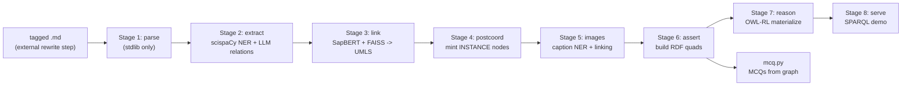

# Domain Knowledge-Graph Pipeline

`src/domain_kg/` — a staged pipeline that turns tagged medical-textbook markdown into an
RDF knowledge graph (entities, relations, UMLS/SNOMED links) plus MCQs generated directly
from that graph. Ported wholesale from a standalone `knowledge-graph-pipeline` ("medkg")
repo on `feat/textbook-parser` (commit `2892222`, 2026-08-12) so it runs in-process
instead of as an external tool.

**Status: not wired into the live app.** `grep -rn "domain_kg" app/ scripts/ src/*` (outside
`src/domain_kg/` itself) returns zero matches. This is a separate knowledge graph from the
one [06-student-graph.md](06-student-graph.md) describes — `student_kg` (tracks students/
answers/mastery) and `domain_kg` (medical facts extracted from textbooks) are two distinct
Neo4j-adjacent systems that currently share no code path. `load_neo4j.py` does import
`src.student_kg.driver`, but it's a standalone script nobody calls from the app — a real
but so-far-unexercised link.

## Why it exists / how it differs from the MCQ pipeline

This is **not** the same thing as [04-mcq-generation.md](04-mcq-generation.md)'s
notebook pipeline. That one goes chunk → LLM triple extraction → MCQ, per document, with
no persistent graph. This one builds an actual RDF knowledge graph — NER, entity-linking
to UMLS/SNOMED, deterministic post-coordination, RDFS/OWL-RL reasoning — and only then
optionally generates MCQs (`mcq.py`) from the resulting graph. Whether this is meant to
replace, feed into, or run alongside the existing MCQ notebook is an open decision — see
[HANDOVER.md](HANDOVER.md).

## Pipeline stages



| Stage | File | Does | In | Out |
| --- | --- | --- | --- | --- |
| 1 — parse | `stages/stage1_parse.py` | Parses tagged markdown (`<con>`, `<def>`, `<key>`, `<clin>`, `<cap>`, ...) into IR chunks/passages/figures; strips tags to a normalized text file all later offsets index into. Stdlib only. | Tagged `.md` (from an external `rewrite_medical_md.py`, not in this repo) | `Document` IR + `*.normalized.md` |
| 2 — extract | `stages/stage2_extract.py` | scispaCy NER + negation detection, then an injectable LLM pass for relations/modifiers. Grounding guards enforce every span is an exact substring of the source text. | Stage-1 IR | IR + `spans`, `relations`, modifiers |
| 3 — link | `stages/stage3_link.py` | Entity-links spans to UMLS via SapBERT embeddings + FAISS cosine search over `MRCONSO`. Requires a licensed UMLS release and a prebuilt index (`cli/build_index.py`). | Stage-2 IR + FAISS index | IR with `uri`/CUI per span |
| 4 — postcoord | `stages/stage4_postcoord.py` | Mints deterministic `INSTANCE` nodes for spans carrying role-changing modifiers (e.g. negation, deviation) so "iodine deficiency" doesn't get asserted as a fact about iodine. Pure stdlib. | Linked IR | IR with `instances` |
| 5 — images | `stages/stage5_images.py` | Runs figure captions/descriptions through NER+linking to produce `depicts` annotations on `Figure`, kept separate from `Span` so image prose is never asserted as clinical fact. | IR + figures | IR with `Depiction` entries |
| 6 — assert | `stages/stage6_assert.py` | Builds RDF quads — one named graph per `(document, section)`, deterministic URIs. Uncertain/reified relations are kept but not asserted as fact. | Full IR | RDF quads (rdflib `Dataset`) |
| 7 — reason | `stages/stage7_reason.py` | In-process RDFS/OWL-RL closure via `owlrl`, materialized into a separate `urn:graph:inferred` graph — never mixed with asserted triples. | Asserted `Dataset` | `Dataset` + inferred graph |
| 8 — serve | `stages/stage8_serve.py` | Demo SPARQL query layer over the in-memory `Dataset`. Documents that production use means serializing to N-Quads and loading into a real triplestore instead. | `Dataset` | Query results (console) |

Root-level support modules (not stages, used across the pipeline):

| Module | Role |
| --- | --- |
| `ir.py` | `Document` IR dataclasses — every stage reads one, adds fields, never mutates what an earlier stage wrote. |
| `guards.py` (1047 lines) | Deterministic, LLM-free checks on Stage 2 relations (e.g. direction conflicts); demotes suspect relations to `uncertain` and logs `needs_review` rather than silently dropping or trusting them. |
| `corpus.py` | Multi-document orchestration — `discover()` turns a directory into an ordered input list, `plan_artifacts()` gives each document its own artifact dir so a corpus run resumes per-document. |
| `mcq.py` | Generates single-best-answer MCQs from a Stage-6 IR; uses each fact's `polarity`/`evidence_start`/`evidence_end` to avoid asserting negated facts and to pool distractors. |
| `ontology.py` | Loads/validates the relation & modifier ontology from JSON (`data/ontology_medschool.json`, overridable via `MEDKG_ONTOLOGY` or `--ontology`). |
| `console.py` | Shared batched progress-reporting helpers — the pipeline is long-running and otherwise silent between artifacts. |
| `native_env.py` | See "macOS segfault workaround" below. |
| `load_neo4j.py` | Loads `data/graph.nq` into Neo4j via the n10s plugin (re-serializes to N-Triples first, since n10s import is triple-based and drops named-graph structure). |

## macOS segfault workaround (`native_env.py`)

`torch`, `thinc`/`blis` (spaCy's backend), and `faiss` each build their own thread pool at
import time; two of them doing so in one process is a known cause of a bare
`Segmentation fault: 11` with no Python traceback — the tell is that the crash follows
*load order*, not any particular library. Thread counts must be pinned **before** these
libraries load, so `domain_kg/__init__.py` does it as the very first import:

```python
from . import native_env as native_env  # noqa: F401  -- must be first
```

Controlled by `MEDKG_NATIVE_THREADS` (default `1`, `0` disables pinning) and
`MEDKG_ALLOW_DUPLICATE_OMP`. If you add a new entry point under `domain_kg`, import the
package itself first (not a submodule directly) or this ordering guarantee breaks.

## LLM backends

Three backends, selected via `--llm {claude,meditron,huatuo}`:

- **Claude (default)** — used directly in `stage2_extract.py`, not through
  `llm/llm_backends.py`. `_call_anthropic()` lazily imports `anthropic`, reads
  `ANTHROPIC_API_KEY`, and model id comes from `config.py`:
  `MEDKG_LLM_MODEL` env var, defaulting to `claude-sonnet-4-5`.
- **meditron** (`llm/llm_meditron.py`) — adapter over `llm/llm_backends.py`'s
  `meditron3-8b-gguf` profile (llama.cpp, JSON-schema guided decoding).
- **huatuo** (`llm/llm_huatuo.py`) — adapter over the `HuatuoGPT-o1-72B-4bit` profile
  (vLLM, guided JSON, reasoning model). This is `cli/build_ontology.py`'s default.

Both self-hosted backends point at a hardcoded internal Jupyter host by default
(`llm_backends.py`'s `_SHARED_URL`), overridable per-backend via
`<PREFIX>_URL`/`_MODEL`/`_GUIDED`/`_MAX_TOKENS` env vars. All three backends implement the
same `call_llm(system, user, schema)` signature, so swapping one in is a CLI flag, not a
code change.

## CLI entry points

All `argparse`-based, all runnable as `python -m src.domain_kg.cli.<name>`:

| Command | Key args | Produces |
| --- | --- | --- |
| `cli/run.py` | `--mode {stage1,stage2,stage3,full,from-stage3,review,corpus,guards}`, `--llm`, `--input`, `--index-dir`, `--ontology`, `--out`, `--artifacts`, `--no-resume` | IR JSON, `.nq` graph, or a printed review queue, depending on `--mode` |
| `cli/subset.py` | `<graph.nq>`, `--doc`/`--section`/`--group`, `--list-scopes`, `--dry-run`, `--include-inferred`, `--reason`, `--out` | A standalone `.nq` subset (with labels + provenance + catalog carried along) |
| `cli/build_index.py` | `--mrconso`, `--mrsty`, `--sabs`, `--max-atoms`, `--out-dir` (default `./umls_index`) | `umls.faiss`, `cuis.npy`, `codes.json`, `names.json` (+`semantic_types.json` if `--mrsty` given) — the Stage 3 linking index |
| `cli/build_ontology.py` | `--from-srdef`/`--srstre2`, `--induce`, `--llm` (default `huatuo`), `--merge`/`--into` | `proposals.json`, or a merged ontology JSON |
| `cli/query.py` | `<graph.nq> [query]`, `--list`, `--about`, `--sparql`, `--file`, `--limit` | Printed query results |

`cli/query.py` is a straight rename of what was previously `domain_kg/query.py` at the
package root (no content change in the port commit). The other four `cli/` files are new.

## Data (`src/domain_kg/data/`)

Note the `.gitignore` change in the port commit: `data/` → `/data/` (anchored to repo
root). That means `src/domain_kg/data/` is **no longer excluded** — everything below is
git-tracked, unlike the root-level `data/` directory described in
[HANDOVER.md](HANDOVER.md) §2.

- `ontology_medschool.json` — the relation/modifier ontology `config.py` loads at import
  time (`version, notes, ner_models, relations, modifiers, modifier_values,
  label_hierarchy`).
- `graph.nt` / `graph.nq` — serialized RDF graph/dataset artifacts (3.6MB / 4.6MB).
- `docs/` — 10 pre-processed textbook sections (`abdominal_wall`,
  `anatomy_of_endocrine_glands`, `anatomy_of_face_and_oral_cavity`, `anatomy_of_neck`,
  `anatomy_of_pelvic_floor`, `digestive_system`, `endocrine`, `histology_digestive_1`,
  `histology_endocrine`, `parathyroid_gland`), each with `<name>.normalized.md`,
  `ir.json`, `stage1.json`, `stage2.json`. These are worked examples / fixtures from the
  source medkg repo, not generated from this repo's own `data/textbook/` PDFs.

## Environment: a third, separate Python env

[HANDOVER.md](HANDOVER.md) previously documented two envs (`.venv`, `.venv-mineru`). This
port adds a real third constraint, not yet resolved:

Stage 2 (NER) and Stage 3 (entity linking) depend on scispaCy + spaCy `<3.8` + `faiss-cpu`,
which only ship wheels for **Python 3.9–3.11**. The main project pins
`requires-python = ">=3.13"` (`pyproject.toml`), so these are deliberately **not** added
as project dependencies — adding them would break `uv sync` for everyone. Stages 1, 4, 5,
6, 7, 8 plus `guards.py`/`corpus.py`/`mcq.py` run fine in the main `.venv`. Stage 2 and
Stage 3 need a separate Python 3.11 environment until this conflict is resolved — there is
currently no committed recipe for that env (no `requirements-domain-kg.txt` or similar);
whoever runs Stage 2/3 needs to build one by hand from `stage2_extract.py`/
`stage3_link.py`'s imports.

New main-env dependencies added by the port: `anthropic>=0.40` (Claude backend),
`owlrl>=6.0` (Stage 7 reasoning).

## Known gaps / open items

- **Not called from anywhere.** No script, notebook, or app code invokes any `domain_kg`
  CLI or imports the package outside itself. It's a complete, standalone pipeline with no
  scheduled or triggered run.
- **No integration decision recorded** for how this relates to the existing
  `notebooks/mcq_generation.ipynb` pipeline ([04-mcq-generation.md](04-mcq-generation.md))
  — same problem (textbook → questions), two different mechanisms, no documented plan for
  which wins or whether both persist for different purposes.
- **UMLS/SNOMED licensing.** `config.py`'s module docstring flags that the SNOMED/RxNorm
  codes in `config.py` are illustrative placeholders — verify every code against a
  licensed UMLS/SNOMED release before treating any output as clinically authoritative.
  Same licensing caution as raised for textbook PDFs in [HANDOVER.md](HANDOVER.md) §2, but
  for UMLS/SNOMED specifically: `cli/build_index.py` expects a local `MRCONSO.RRF`, which
  is itself under a UMLS license and isn't (and shouldn't be) checked into this repo.
- **The `data/docs/` fixtures are from the source medkg repo's corpus**, not derived from
  this project's own `data/textbook/` PDFs — running the pipeline against this project's
  actual source material has apparently not happened yet in this repo.
- **Third Python env has no committed setup recipe** (above) — the next person to run
  Stage 2/3 has to reconstruct it from source imports.
