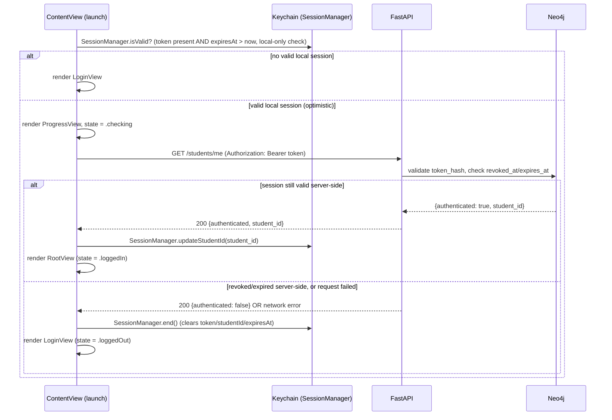
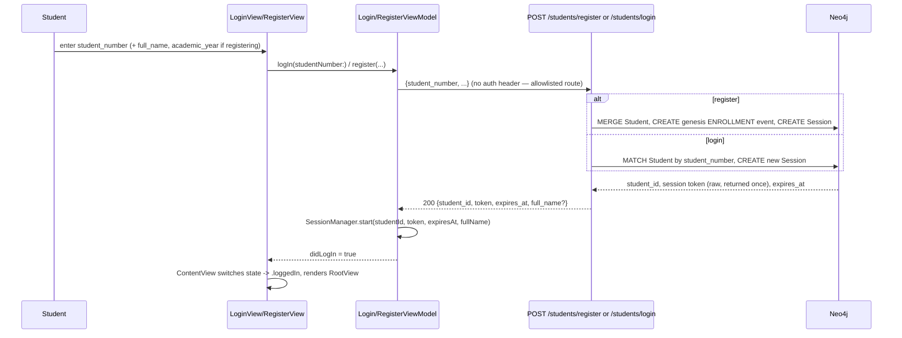
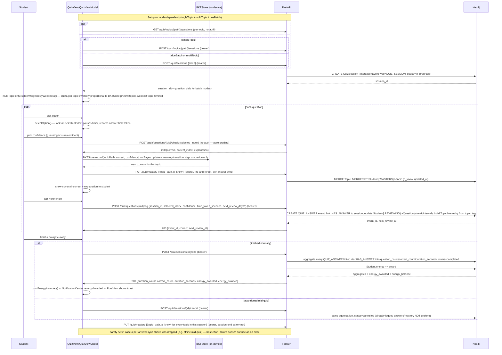
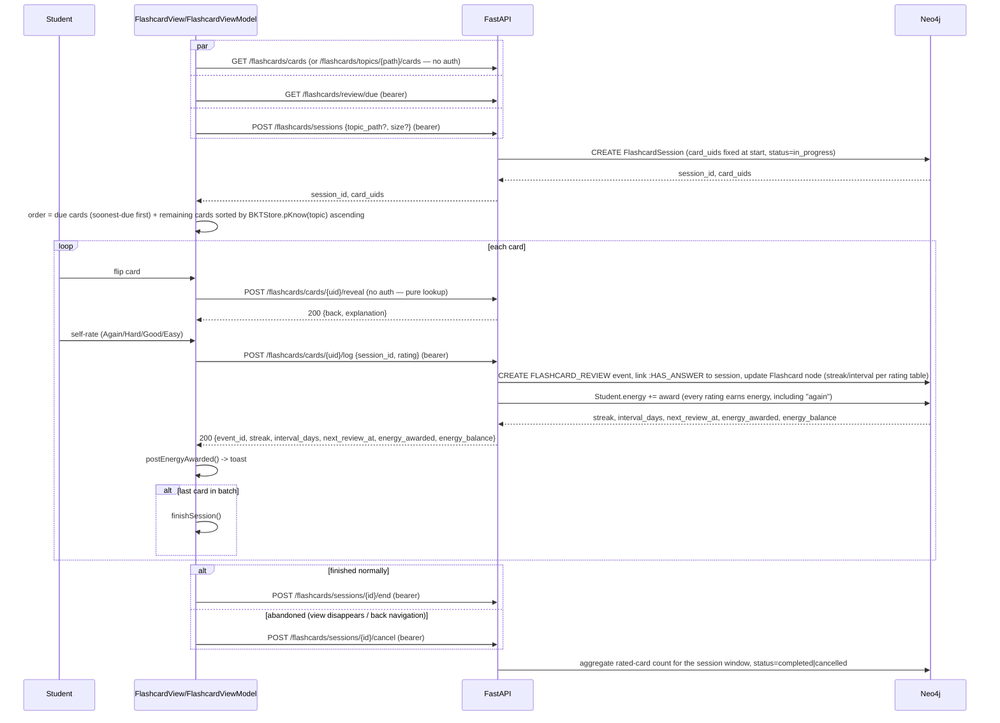
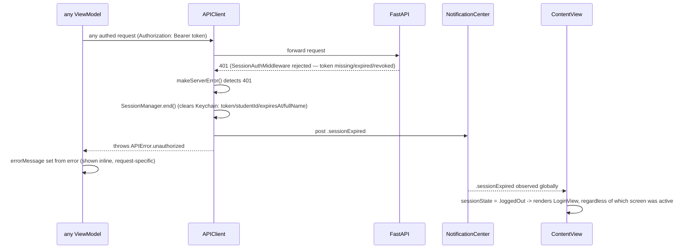

# Frontend Integration — iOS client sequence diagrams

The live serving layer ([05-serving-api.md](05-serving-api.md)) has one real client
today: `personalized-medical-learning-ios`, a native SwiftUI app in a sibling repo
(`personalized-medical-learning-ios/`, not part of this repo). This doc traces the actual
call sequences between that app and this API, end to end, for every major flow — written
from reading the client source directly (`Core/Networking/`, `Core/Persistence/`,
`Features/*/*ViewModel.swift`), not just the API surface. If a flow here and
[05-serving-api.md](05-serving-api.md)/[06-student-graph.md](06-student-graph.md) ever
disagree, this doc is describing what the client actually does today; those are
describing what the server does — cross-check both before assuming either is stale.

## Client architecture, in brief

- **`Core/Networking/APIClient.swift`** — single HTTP client (`URLSession`-backed).
  `get`/`post`/`send` all funnel through `executeWithRetry`, which retries up to twice
  (short exponential backoff) on connection-level failure only (timeout, DNS, host
  unreachable) — **never** after a response was actually received, so a write whose
  side effect already landed server-side is never silently resent. Every non-2xx goes
  through `makeServerError`, which decodes this API's `{"error": {code, message,
  details}}` envelope (see [05-serving-api.md § Error envelope](05-serving-api.md#error-envelope))
  into a typed `APIError`.
- **`Core/Persistence/SessionManager.swift`** — Keychain-backed bearer token +
  `expiresAt` + `studentId`. `SessionManager.token` is the default `token:` argument on
  every authed `APIClient` call site, so route handlers don't thread it through
  manually.
- **`Core/Persistence/BKTStore.swift`** — the client-side Bayesian Knowledge Tracing
  engine. Computes `p_know` on-device (see "Mastery sync" below); this is the frontend
  half of the split documented in
  [06-student-graph.md § Mastery](06-student-graph.md#mastery--masters-not-event-sourced-by-design-trade-off)
  and [09-knowledge-tracing.md](09-knowledge-tracing.md).
- **`APIError.unauthorized` handling** — any `401` response, from *any* endpoint, calls
  `SessionManager.end()` and posts `NotificationCenter` `.sessionExpired` as a side
  effect of `makeServerError` itself, before the error even reaches the calling
  ViewModel. `ContentView` observes that notification globally and force-navigates back
  to the login screen — see "Session expiry" below.

## 1. App launch → auth



`SessionManager.isValid` is a **local-only** expiry check (Keychain timestamp vs.
`Date()`) — it never talks to the server. `GET /students/me` is the actual
server-side confirmation, since the server can revoke a session (logout, future
"log out everywhere") independent of the client's locally-cached `expiresAt`. This is
why launch always does both checks in sequence rather than trusting the local one alone.

## 2. Register / Login



Register is rate-limited 5/min, login 10/min server-side (`slowapi`, see
[05-serving-api.md](05-serving-api.md)) — a `429` surfaces client-side as
`APIError.rateLimited(retryAfterSeconds:)`, decoded from the `Retry-After` header in
`makeServerError`.

## 3. Dashboard load

`DashboardView` fires several independent authed `GET`s in parallel on appear, plus one
self-throttled BKT-params refresh:

```mermaid
sequenceDiagram
    participant DV as DashboardView
    participant API as FastAPI
    participant BKT as BKTStore (on-device)
    participant N as Neo4j

    par
        DV->>API: GET /students/me/profile
        API->>N: read Student node
        N-->>API: name, student_number, academic_year, enrolled_at
        API-->>DV: 200 StudentProfileResponse
    and
        DV->>API: GET /students/me/streak
        API->>N: compute current_streak/previous_streak/week_activity (on read, see 06-student-graph.md)
        N-->>API: streak data
        API-->>DV: 200 StreakResponse
    and
        DV->>API: GET /students/me/energy
        API->>N: read Student.energy
        N-->>API: balance
        API-->>DV: 200 EnergyResponse
    and
        DV->>API: GET /students/me/nudge
        API->>N: count due QUIZ + due FLASHCARD items
        N-->>API: due counts + soonest-due item
        API-->>DV: 200 NudgeResponse
    end
    DV->>BKT: refreshParamsIfNeeded()
    alt cached fit older than 6h, or never fetched
        BKT->>API: GET /quiz/mastery/params  (bearer)
        API->>API: bkt_fit.py::get_fitted_params (in-process 6h cache; EM-refit from pooled QUIZ_ANSWER history if expired)
        API-->>BKT: {p_init, p_transit, p_slip{...}, p_guess{...}}
        BKT->>BKT: cache in UserDefaults + fetchedParamsAt
    else cache still fresh
        BKT->>BKT: no-op, keep cached params
    end
```

The `GET /quiz/mastery/params` fetch is deliberately best-effort and self-throttled to
match the server's own 6h EM-refit cache TTL (`src/quiz/bkt_fit.py::_CACHE_TTL_SECONDS`)
— see [09-knowledge-tracing.md § Keeping params fresh](09-knowledge-tracing.md#keeping-params-fresh).
A device that has never successfully fetched (e.g. first launch offline) silently runs
on `BKTStore`'s hand-picked bootstrap constants instead — this call never blocks
dashboard render.

Tapping a nudge (`onReviewDue`) or a subject card (`onPracticeTopic`) routes into the
quiz/flashcard setup flows below with a preselected topic or a due-batch flag —
no additional network call at that hand-off, `RootView` just flips local `@State`.

## 4. Quiz flow — setup → answer loop → finish

This is the most involved flow in the app; `05-serving-api.md`'s "Quiz router — check /
log" section documents *why* check and log are two endpoints from the server's side.
This sequence shows the full client-driven loop around those two calls, including the
parts that never leave the device (BKT).



**Why `PUT /quiz/mastery` fires twice per topic (per-answer *and* at session end)** —
`checkAnswer()`'s per-answer push (`Task { }`, detached, non-blocking) is the fast path so
the server stays current within one answer instead of lagging until the whole quiz
finishes; `finishQuiz()`'s push is a safety net for whatever that fast path dropped (most
commonly: offline mid-quiz). Both are best-effort (`try?`) — a failed push never blocks
UI or surfaces as a user-facing error, since `BKTStore`'s on-device value is already the
source of truth the student has already seen.

**Where `p_know` is actually computed — one more time, explicitly**: nowhere in the
sequence above does the server compute or validate `p_know`. `BKTStore.record` (client)
does the entire Bayesian update; `src/quiz/mastery.py::upsert_mastery` (server) does a
`MERGE`+`SET`, full stop. See
[06-student-graph.md § Mastery](06-student-graph.md#mastery--masters-not-event-sourced-by-design-trade-off)
for the design history behind that split.

## 5. Flashcard flow — setup → reveal → rate → finish

Structurally parallel to quiz, but reveal/rate replaces check/confidence-then-log, and
there is **no on-device BKT/mastery write** — flashcard scheduling (streak/interval) is
entirely server-side, per-card, and unrelated to `MASTERS`
(see [06-student-graph.md § Flashcard scheduling](06-student-graph.md#flashcard-scheduling--flashcard-node-flashcard-side)).



`hasEnded` (client-local flag) guards against double-firing end/cancel — both `onDisappear`
and the natural end-of-deck path can trigger a finish, so the client de-dupes rather than
relying on the server to no-op a repeat call.

## 6. Session expiry — any authed call, any time



This is a global side effect baked into `APIClient.makeServerError`, not something each
ViewModel opts into — any 401 from any endpoint, at any point in the app, force-navigates
the whole app back to login. `RootView`'s in-progress-quiz confirmation alert has no
special case for this: an expired session mid-quiz drops straight to `LoginView`, the
"Leave quiz?" alert is only for a student-initiated tab switch.

## Where this diverges from a naive reading of the API docs

- [05-serving-api.md](05-serving-api.md)'s check/log sequence diagram shows the
  **minimum** shape (grade, then log). The real client interleaves two more
  client-only steps in between — the on-device BKT update and the per-answer
  `PUT /quiz/mastery` push — neither of which touches `/check` or `/log` at all.
- Nothing in `app/routers/quiz.py` or `mastery.py` computes `p_know`. Every mermaid
  diagram in this doc that shows a mastery number in flight is showing a number that
  originated in `BKTStore.swift`, not on the server — repeated here because it's easy to
  misread `PUT /quiz/mastery` as a compute endpoint from its name alone.
- `GET /quiz/mastery` (server-stored, weakest-first) is **not** called anywhere in the
  quiz/flashcard flows above — the app reads mastery for in-session weighting
  (`selectWeightedByWeakness`, due-card ordering) directly from local `BKTStore`, not
  from the server. The server-stored copy exists for cross-device sync/display, not as
  the client's own read path during a session.
